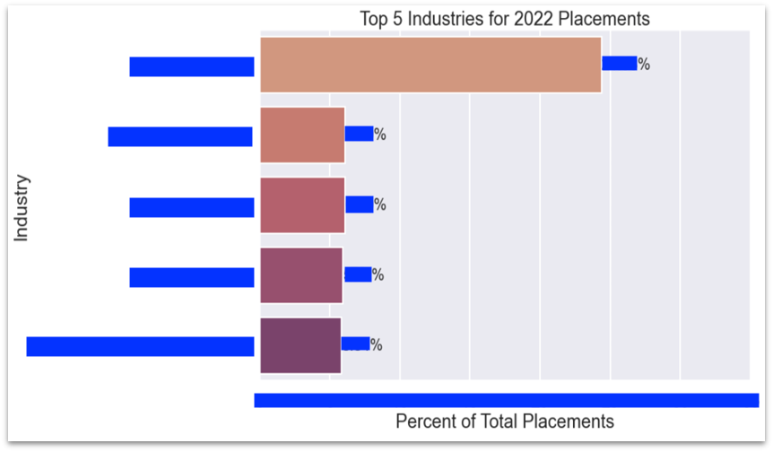
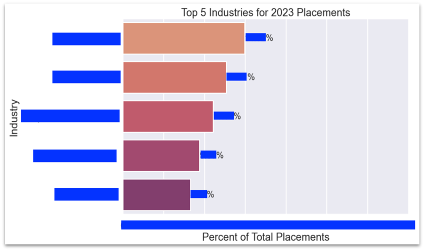

# Sample Sales and Marketing Analysis Project
#### By Nicole Michaud

(Based on a project presented in June of 2023)

For my previous employer, I utilized my data science and data analysis skills to conduct research on internal and external processes, aimed at advising and improving stakeholder and company efforts.
As per my previous employer's request, I cannot share the actual metrics or results of this research.
However, to demonstrate the skills and outcomes of this project, I have created this sample presentation.
The original presentation was in a PowerPoint, however I have included all the anonymized visualizations and findings here, for simplicity.

This was one of my first projects while learning data science/data analysis, and it gave me important hands-on experience not only applying ETL, data cleaning, and data analysis concepts to real-world data, but also in communicating my findings to non-technical stakeholders and providing recommendations.

Note: The company was in the recruiting and staffing industry-- "placements" refers to jobs placed by the company, "sales" refers to new clients gained, "job category" refers to the type of job a placement was for.

 	

### Internal Research - anonymized examples of research and analysis done on internal company data

- In the past 3 years, what industries has the company made the most placements in overall?

- What industries did the company make the most placements in for each of those years, individually?

- For the company's main areas of expertise (as listed on their website), what were the percent of placements in each of those areas in the past 3 years?

- What were the most common job titles placed in each area of expertise?
	- Area of Expertise X: 
		- Title 1
		- Title 2
		- Title 3
		- Title 4
		...

- What industries does the company make the most revenue from?
	- "The top 10 industries make up XX% of the company's total revenue"
	- The top industries:
		1. XX
		2. XX
		3. XX
		4. XX
		...

- What placement categories does the company make the most revenue from?
	- "The top 10 categories make up XX% of the company's total revenue"
	- The top categories:
		1. XX
		2. XX
		3. XX
		4. XX
		...

### External Research - research and analysis done using publicly available data from BLS.gov and the Indeed Hiring Lab

- For the company's areas of expertise, what are the trends in job postings?

- What are the trends in job postings across the different regions of the country?

 	

### Comparisons and conclusions - Some of the conclusions I drew from the data and how it was used to advise company efforts

- Do the trends in job postings for different areas of expertise align with trends in the company's placements?

- Do the trends in job postings for different US regions align with trends in the company's placements?
	
	- What locations should the company focus more effort towards in terms of sales and placements?

- In sales and placements from recent years, what industries or categories has the company seen growth in, and which areas should they refocus efforts toward?

- Does the marketing efforts and budget aimed at different industries and placement categories align with those that the company makes most of its revenue from, that are trending nationally, or that have otherwise shown potential?
	
	- What specific areas should we refocus efforts toward?
	
	
 
 

Thank you for viewing this sample research and analysis project I put together. I hope it gave an accurate idea of the ways in which my technical and data storytelling skills were put to use in my previous role.

My other projects can be viewed on <a href="https://github.com/nicolemichaud03">my Github</a>.

<a href="https://linkedin.com/in/nicole-michaud2">View my Linked in Profile here</a>